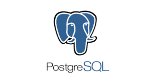
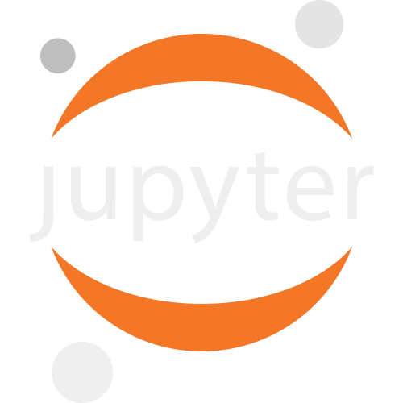

<body style="background-color:#33475b">

<h1 align="center">  
  Hello, I am Anushka Krishna.
</h1>

## 📜 Education
- Pursuing **B.Sc. in Programming and Data Science** from IIT Madras (2021-2024).  
- Pursuing **B.Tech. in Electronics & Communication Engineering** from Muzaffarpur Institute of Technology (2019-2023).  
- Completed **Intermediate** from Harrow English School (CBSE-91%)(2017-2019).  
- Completed **High School** from Holy Cross School, Darbhanga (CBSE-10 CGPA)(2005-2017).    

## 👨🏻‍💼 Experience
- Completed 4-weeks of In-plant training internship at **BSNL, Darbhanga**. 
- Conference Auditorium Help-desk IIT Coordinator at PanIIT Alumni India.  
- College Ambassador at Techfest(Kshitij), IIT Kharagpur.    

<h2>
  Skill set
</h2>

  
  
  
  
  
  
  
  
  
  
  
  
  
  

  

## 🏆 Achievements
<h2> Certifications </h2>
<table align="center">
  <td>
    ✨ Problem Solving Through Programming in C (NPTEL)  
    ✨ Signals And Systems (NPTEL)  
    ✨ Foundational Course in Programming and Data Science by IIT Madras 
    ✨ CODE RIDERS-2021 (CISCO NETWORKING ACADEMY)  
    ✨ An Introduction to Internet Of Things ( IoT) Specialization (COURSERA)  
    
 &nbsp &nbsp -Interfacing with the Arduino  
        &nbsp &nbsp -Interfacing with the Raspberry Pi  
        &nbsp &nbsp -Introduction to internet of things and embedded systems  
        &nbsp &nbsp -The Arduino Platform and C Programming  
        &nbsp &nbsp -The Raspberry Pi Platform and Python Programming for Raspberry Pi  
        &nbsp &nbsp -Programming for Everybody (Getting Started with Python)  
        &nbsp &nbsp -Python Data Structures  
    ✨ CODE RIDERS-2021 by CISCO NETWORKING ACADEMY 
  </td>
</table>  

## ✨ Interests and Hobbies
- Meticulousness  
- Travelling  
- Badminton  
- Sketching & Painting    

## Connect with me:</h3>

  
 
        
        
        
        
  
  

<h2>
  
  My GitHub Statistics:
</h2>
<table>
  

    
    
    
  

</table>

  
 <samp>&#9776; More details </samp>

    

      
    

  

      <h3>
        🏆 Github Profile Trophies
      </h3>
      
    

   

